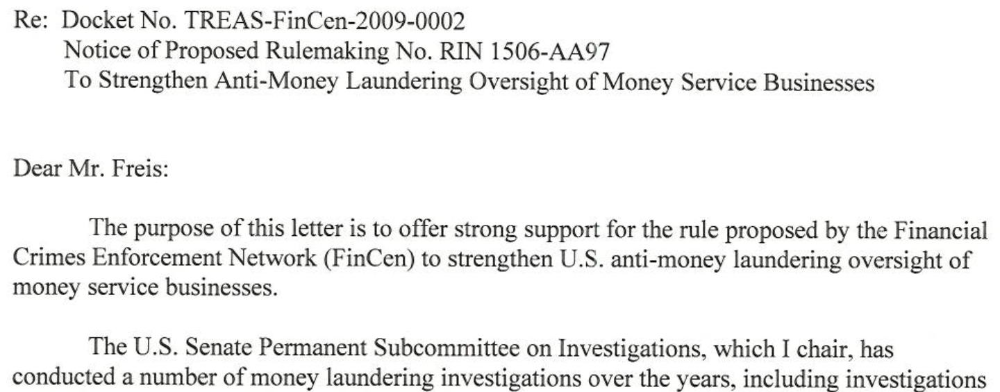
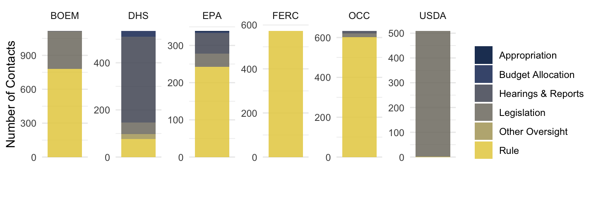

```{r setup, include = FALSE}
# chunks options:
# hide code and messages by default (warning, message)
# cache everything 
knitr::opts_chunk$set(warning = FALSE, 
                      message = FALSE,
                      echo = FALSE, 
                      #fig.path = "figs/",
                      cache = FALSE, 
                      fig.align = 'center',
                      fig.retina = 2,
                       out.width="100%",
                      dpi = 100)
# Xaringan: https://slides.yihui.name/xaringan/
library("xaringan")
library("xaringanthemer")
library("here")
library("knitr")


style_mono_light(base_color = "#3b444b",
          link_color = "#297acc", #"#B7E4CF",
          background_color = "#FFFFFF", # "#FAF0E6", # linen
          header_font_google = google_font("Open Sans"), 
          text_font_google = google_font("Roboto"), 
          text_font_size = "32px",
          padding = "30px",
          code_font_google = google_font("Inconsolata"), 
          code_inline_background_color    = "#FFFFFF", 
          table_row_even_background_color = "#ddede5",
          extra_css = 
            list(".remark-slide-number" = list("display" = "none")))

#xaringan::decktape(file =  here("docs/present/oversight-pres.html"), output = here("docs/present/oversight-pres.pdf"))
```

# Preview

### How do legislators engage with federal agencies?
--

- Pre-legislation coordination 
--

- Traditional oversight (e.g., hearings, investigations, & reports)
--

- Post-legislation agency policymaking (e.g., rulemaking & budget allocation)  
--

- Casework/constituency service (implementation)
--


### New data & measures 
- Legislator correspondence with agencies (from FOIA requests)
--

- Agency rulemaking records
--

- Agency budget justifications & appropriation subcommittee reports

???

Instead of starting with a definition of congressional oversight behavior and seeking out measures for it, I start with data on contacts between members of Congress and federal agencies and ask what portions might be thought of as different types of oversight. My inductive approach provokes some conceptual issues about what counts as oversight. 

---


###  Traditional oversight (e.g., hearings, investigations, & reports)

```{r, fig.cap = "", out.width="70%"}

```

---

### Oversight investigations inform agency policy 

```{r, fig.cap = "", out.width="55%"}
knitr::include_graphics("figs/levin/rulemaking-fincen-large.png")
```

---

### Oversight investigations inform agency policy 

```{r, fig.cap = "", out.width="95%"}

```

???

Citing those investigations and hearings, Levin here wrote in support of a proposed rule from the Treasury Financial Crimes  Enforcement Network.

---

### Oversight investigations inform agency policy 

```{r, fig.cap = "", out.width="95%"}

```

???
Here, in 2012 senator living wrote to the IRS, entering a Committee Report and full 1000-page hearing transcript into the record supporting the rule. 

THIS ONE NEARLY BROKE MY TEXT PROCESSING ALGORITHM. NOT ONLY WAS IT 1000 pages, but it was full of other members of Congress! 

---

### Oversight investigations inform agency policy 

```{r, fig.cap = "", out.width="80%"}

```

???

Here is another example: Senator Levin writes this letter chastising five agencies for being too slow to make rules.

---

### Legislators inform statutory interpretation

```{r, fig.cap = "", out.width="97%"}

```

---

### Legislators inform statutory interpretation

```{r, fig.cap = "", out.width="97%"}

```


---

### Legislators inform how agencies use discretionary authority

```{r, fig.cap = "", out.width="59%"}

```

<!---

### Legislators inform policy

```{r, fig.cap = "", out.width="60%"}

```


???
Here Senator Levin and others urge SSA to withdraw. 

### Policy-related constituency service (implementation)


-->

---

### Policy-related constituency service

```{r, fig.cap = "", out.width="75%"}

```

---

class:  inverse middle

# New data & measures 

- 500,000+ legislator contacts (obtained through FOIA requests)

- 50+ million rulemaking comments (5,000+ from legislators)

---

### Most legislator contacts address implementation


```{r, fig.cap = "", out.width="70%"}

```


---

### Most policy-related contacts are oversight of agency rulemaking

```{r, fig.cap = "", out.width="80%"}
knitr::include_graphics("figs/oversight-prepost-1.png")
```

---

### Most policy-related contacts align with public-interest group efforts

```{r, fig.cap = "", out.width="100%"}

```

---

### Policy-related contacts were more often from democrats 2007-2020

```{r, fig.cap = "", out.width="95%"}
knitr::include_graphics("figs/oversight-data-party-1.png")
```

---

### Policy-related contacts were more often from democrats 2007-2020

```{r, fig.cap = "", out.width="95%"}

```


---

### Types of policy-related contacts/oversight vary across agencies 


```{r, fig.cap = "", out.width="100%"}

```

---

### Legislator attention to agency rulemaking is uneven over time 

Most agency rules receive no attention from legislators

```{r,fig.cap = "Rulemaking Comments from Members of Congress per Year, 2005-2020", out.width="75%"}

```


???

Bureau of Ocean Energy Management (BOEM), Consumer Financial Protection Bureau (CFPB), Department of Education (ED), Office of Energy Efficiency and Renewable Energy (EERE), Federal Aviation Administration (FAA), Fish and Wildlife Service (FWS),  Office of the Comptroller of the Currency (OCC), Occupational Safety and Health Administration (OSHA), Social Security Administration (SSA), U.S. Trade Representative (USTR)
One mechanism by which campaigns may influence policy is by mobilizing members of Congress. Thus, I identify comments submitted by members of Congress and count the number of legislators in each lobbying coalition. Figure \@ref(fig:data-congress) shows the number of comments from members of Congress received during rulemaking by a sample of federal agencies. There is massive variation in the level of attention that members of Congress pay to different agencies and rules. The spikes in attention to each agency correspond with public pressure campaigns targeting rules from that agency. Oversight letters are frequently co-signed by multiple members from the Senate, House, or both chambers. Some of the rules on which members of Congress commented appear in the hand-coded sample. Table \@ref(tab:data-coded-elected) shows the number of comments from the most common types of elected officials in the hand-coded data. Members of the U.S. House and Senate are the most common. 


---

class: inverse middle

# Findings

---

### Committee chairs do more policy work

```{r, fig.cap = "", out.width="60%"}

```

---

### Committee chairs do more policy work

```{r, fig.cap = "", out.width="60%"}

```


---

### More experienced members do more policy work


```{r, fig.cap = "", out.width="55%"}

```


---

# Thank you! 

- Slides & data: [judgelord.github.io/research/oversight](https://judgelord.github.io/research/oversight)"

Next steps:

- What portion rulemaking 


---

class: inverse middle 

# Extra Slides 


---

class: inverse  middle 


# Interest groups mobilize oversight

---

A [press release from the Sierra Club](https://www.sierraclub.org/press-releases/2019/08/trump-extinction-plan-guts-endangered-species-act) on 2019 rule to consider cost, not climate, under the Endangered Species Act (1972, amended 1982)

```{r, fig.cap = "Sierra Club Press Release"}

```


???

"Last fall, 105 Members of Congress and 34 U.S. Senators sent letters to Trump's Department of the Interior to protest the harmful rollbacks." https://www.sierraclub.org/press-releases/2019/08/trump-extinction-plan-guts-endangered-species-act

https://www.regulations.gov/comment/FWS-HQ-ES-2018-0006-53372

https://www.epw.senate.gov/public/index.cfm/2018/9/senators-carper-and-udall-lead-democratic-senators-in-raising-concerns-over-trump-administration-s-attacks-on-landmark-endangered-species-act

---

## 90% of U.S. law is now made in agencies rather than Congress. 

Lobbying & pressure campaigns thus target bureaucratic policymaking. 

- Do pressure campaigns affect congressional oversight? 

- Do allies in Congress help pressure campaigns win? 

---

## Do pressure campaigns mobilize oversight? 

Lobbying 

- Legislators write more letters supporting companies when they receive more PAC funding from those companies [(Powell et al., 2022)](https://judgelord.github.io/research/ferc)

Attention (Jones & Baumgartner 2005)

- Mobilized constituencies (e.g., Veterans, Seniors) mobilize legislators [(Snyder et al. 2020)](http://www.womeninlegislativestudies.org/uploads/1/3/5/1/135128342/cr.pdf)

- Legislators follow trending issues (Brookhart & Tahk 2015, Barberá 2019)

- Information affects legislator behavior (Butler and David 2011)

---

## Do allies in Congress help pressure campaigns to win? 

- Agency responses to interest groups depend on Congressional attention (Yackee 2006)

- Legislators respond to pressure. Agencies respond to legislators.

> "Undertakers and used-car dealers were outraged by these proposed rules. Very quickly, members of Congress discovered just how many undertakers and car dealers they had in their districts and how well-connected they were. The FTC suddenly had activated large, hostile interests who were successful in getting Congress to force the agency to back down" (Wilson 1989, 83).

- Yet, lettermarking may be less effective than earmarking (Mills et al. 2015)

---

## Information is the currency of lobbying

### Scholars focus on *technical* information (see Yackee 2019)

- Bureaucratic policymaking, especially, is about expertise (Wagner 2010)

--

### Does *political* information matter?

- Coalition size? (Nelson and Yackee 2012)

- Level of public pressure/attention? (Balla et al. 2020, Judge-Lord 2021)

- Level of attention or support from members of Congress? (Yackee 2006, Wilson 1989, Mills et al. 2015, [Judge-Lord 2017](https://judgelord.github.io/research/budgets/), Lowande & Potter 2021)

???

Everything we know about lobbying, especially lobbying in agency rulemaking, tells us that information is the currency of lobbying. 

Information is how you get policymakers to change their minds, especially experts and lawyers.

Indeed, research shows that business groups dominate lobbying in rulemaking because they have the capacity to generate and provide relevant information. 

Thus far, by information, scholars generally mean technical and legal information (see Susan has recent Annual Review of this scholarship)

- I ask about the role of a different kind of information--what we might call political information, building on Nelson and Yackee's finding that coalition size matters.

---

## Public pressure as *political* information

```{r causal-whymail2, fig.cap = "Direct Effects of Political Information: Incorporating Political Information into Models of Bureaucratic Policymaking"}
# TODO ADD HEADERS, REMOVE LATENT DEMANDS

```

---

## Legislators as mediators of interest-group influence


```{r causal-oversight, fig.cap = "Direct and Indirect Effects of Political Information: Integrating Public Pressure and Congressional Oversight into Models of Bureaucratic Policymaking", out.width="100%"}
#TODO label "Public Pressure" and "Oversight" portions. 

```

---

## An information-based theory of how interest groups and public attention/pressure may affect legislator behavior

Expanding McCubbins & Schwartz (1984)

|                           | Legislator Supports Rule        | Legislator Opposes Rule         |   |   |
|---------------------------|---------------------------------|---------------------------------|---|---|
| Constituents Support Rule | "Beacon" for credit claiming    | "Warning sign" against engaging |   |   |
| Constituents Oppose Rule  | "Warning sign" against engaging | "Fire alarm" for oversight      |   |   |
|                           |                                 |                                 |   |   |

---

## Why legislator attention may affect bureaucratic policymaking

- "Political cover" for agency
- Signal of the general level of public support
- Signal of potential rewards and sanctions (budgets, hearings)
- Procedural politicking (APA, hearings) 

---

class: inverse  middle

# Data 

---

Campaigns engage legislators

```{r, out.width = "70%"}


```

---

Campaigns engage legislators

```{r, out.width = "30%", fig.show = "hold"}


knitr::include_graphics("figs/sierra2.jpeg")
```


---

[Rep. Brad Sherman (D-CA) forwards astroturf campaign signatures opposing CFPB's 2016 payday loan rule.](https://www.regulations.gov/document/CFPB-2016-0025-148844)

```{r, out.width = "100%", fig.cap=""}
  
```

---

[Rep. Brad Sherman (D-CA) forwards astroturf campaign signatures opposing CFPB's 2016 payday loan rule.](https://www.regulations.gov/document/CFPB-2016-0025-148844)

```{r, out.width = "100%", fig.cap=""}
 
```

---

[Rep. Brad Sherman (D-CA) forwards an astroturf campaign signatures opposing regulation of payday loans.](https://www.regulations.gov/document/CFPB-2016-0025-148844)

```{r, out.width = "100%", fig.cap=""}
  
```

Financial Service Centers of America is a trade association for the financial service center industry. 
Checkmate is a payday lender.

---

class: inverse  middle

# Methods 

---

### Text reuse + hand-coding identify coalitions of groups & legislators

```{r percent-match, fig.show = "hold", out.width = "65%", fig.cap="Example: Identifying Coalitions by the Percent of Matching Text in a Sample of Public Comments"}

knitr::include_graphics("figs/comment_percent_match_plot.png")
```

---

### Hand-coded policy positions for interest groups and legislators

```{r spatial-coding, fig.cap= "Coding the Spatial Position of Comments on Proposed Policy Changes", out.width="75%"}
include_graphics("figs/spatial-coding-1.png")
```

---

class: inverse  middle

# Findings

---

- Corporate lobbying opposed Obama's policies and supported Trump's
- Public interest groups and individuals supported Obama's policies and opposed Trump's
- Legislators tended to oppose policies of both administrations

```{r coded-support, out.width= "53%", fig.cap="Hand-coded Comments By Type and Position on Proposed Rule"}

```


---

- Congressional attention spikes with pressure campaigns

```{r,fig.cap = "Rulemaking Comments from Members of Congress per Year, 2005-2020", out.width="90%"}

```


???

Bureau of Ocean Energy Management (BOEM), Consumer Financial Protection Bureau (CFPB), Department of Education (ED), Office of Energy Efficiency and Renewable Energy (EERE), Federal Aviation Administration (FAA), Fish and Wildlife Service (FWS),  Office of the Comptroller of the Currency (OCC), Occupational Safety and Health Administration (OSHA), Social Security Administration (SSA), U.S. Trade Representative (USTR)
One mechanism by which campaigns may influence policy is by mobilizing members of Congress. Thus, I identify comments submitted by members of Congress and count the number of legislators in each lobbying coalition. Figure \@ref(fig:data-congress) shows the number of comments from members of Congress received during rulemaking by a sample of federal agencies. There is massive variation in the level of attention that members of Congress pay to different agencies and rules. The spikes in attention to each agency correspond with public pressure campaigns targeting rules from that agency. Oversight letters are frequently co-signed by multiple members from the Senate, House, or both chambers. Some of the rules on which members of Congress commented appear in the hand-coded sample. Table \@ref(tab:data-coded-elected) shows the number of comments from the most common types of elected officials in the hand-coded data. Members of the U.S. House and Senate are the most common. 


---

- Congressional attention is correlated with pressure campaigns

```{r causal-mediated, fig.cap="", fig.show = "hold", out.width = "50%"}

```

---

Controlling for policy positions,

- Congressional support is weakly correlated with pressure campaigns 
- Public interest coalitions enjoy more legislator support

```{r, fig.cap="", fig.show = "hold", out.width = "65%"}

```

???


---

- When organizations have more congressional support, they are more likely to achieve their policy goals (difference-in-difference design)

```{r mo-success-did, fig.cap="", fig.show = "hold", out.width = "38%"}

```

---

## Summary of Findings

- Congressional attention tracks overall public attention (which is driven by pressure campaigns)

- Pressure campaigns are more of a "fire alarm" or "beacon" than a "warning sign." They attract support but don't deter opposition.

-  Unlike groups and individuals, legislators most often engage when they oppose rules (supporting Lowande & Potter 2021)

- While this often puts legislators on the same side as corporations, controlling for policy position, legislators are slightly more likely to support public interest coalitions

- Lobbying efforts with more allies in Congress are more likely to win

<!--

## Public pressure campaigns target a small portion of policies


Causal mediated 
Policy positions
Sierra 2 
Campaign 1
Campaign 2

Letters from members examples 

Regressions
Mc - Congress

-->

---

class: inverse  middle 

# Examples 

---

## Dividing the party: Constituency vs. partisanship 

[Florida Republican, Vern Buchanan, opposing a Trump-era rule rolling back regulations]( https://www.regulations.gov/comment/BSEE-2017-0008-0473)

```{r, out.width = "100%"}

```

???

Florida Republican Vern Buchanan, on a Trump-era BSEE rule rolling back regulations. Normally members of Congress are pretty supportive of industry in this agency, but Buchanan supported stricter safety rules and even supported the Center for Biological Diversity in his comment.

20+ members of Congress from Florida are commenting in opposition to the BSEE rule https://www.regulations.gov/comment/BSEE-2018-0002-0032

Another one, this time Senators from multiple states but all coastal https://www.regulations.gov/comment/BSEE-2018-0002-19026

And another! https://www.regulations.gov/comment/BSEE-2018-0002-20464

---

## Dividing the party 

[Mike Pence et al. opposing regulatory delay](https://www.regulations.gov/comment/TREAS-DO-2007-0015-0112)

```{r, out.width = "100%"}

```

Gambling industry groups requested state-by-state surveys of gambling laws. Legislators called out this ploy for regulatory delay.

---

[More GOP opposition to gambling rule, now from the Subcommittee on Administrative Law on procedural grounds](https://www.regulations.gov/comment/TREAS-DO-2007-0015-0125)

```{r, out.width = "100%"}

```

---

## Procceedural politicking

> "That's why I am particularly disappointed that CEQ denied my---and more than 160 Members of the House and Senate---request for an extension of the comment period. Further, CEQ simply chose to not respond to our request for additional public hearings. CEQ has proposed a massive overhaul to a set of keystone environmental regulations that have stood in place — largely unchanged for almost half a century. By providing a mere 60-day comment period, and only two public hearings (in Colorado and Washington, DC), CEQ appears uninterested in obtaining broadscale public input." - [Oregon Representative Peter DeFazio, Chairman of the Committee on Transportation and Infrastructure.](https://www.regulations.gov/comment/CEQ-2019-0003-169768)

---


[26 Republicans ask the Comptroller of the Currency for clarity on a 2020 proposed rule that increases regulations between banks and lenders, focusing on the rule's impact on companies.](https://www.regulations.gov/comment/OCC-2020-0026-0002)

```{r, out.width = "100%"}

```

---

[Democrats opposing the same 2020 Comptroller of the Currency rule](https://www.regulations.gov/comment/OCC-2020-0026-0277)

```{r, out.width = "100%"}

```

These examples illustrate how "states' rights" rhetoric is used strategically depending on which side of the substantive issue one is on.
Here, Democrats are advocating for states' rights, while Republicans want a federal standard that would preempt state policy.

---

## Public pressure

[Richard Lugar (R-IN) forwards a letter from a zoo that was mobilized by environmental groups. He does not say whether he supports the campaign.](https://www.regulations.gov/comment/FWS-R9-ES-2008-0093-8782)


```{r, out.width = "100%"}

```

---


## Astroturf

[Democrats push back against an astroturf campaign](https://www.regulations.gov/comment/IRS-2016-0015-0134)

```{r, out.width = "100%"}

```

<!--

nothing super interesting about this joint comment from members of Congress, just that they support the rule, but it could be another example https://www.regulations.gov/comment/NOAA-NOS-2013-0091-0188
-->

---


This [anonymous astroturf email campaign from betterenergyfuture.org](https://www.regulations.gov/comment/EPA-HQ-OAR-2013-0495-11019) used similar language to a [fact sheet posted on the Senate Environment and Public Works committee website](https://www.epw.senate.gov/public/_cache/files/5/d/5d8613e0-0f17-4b22-834e-dc62290e5ed[…]B8DDB0B7674CC20A3FF8D9AC5E.myths-facts---global-wamring.pdf)

```{r, out.width = "100%"}

```

---

```{r, out.width = "100%"}

```

<!--
Democratic Rep. supporting the payday lender rule

Urge the department to withdraw its proposal. 

https://www.regulations.gov/comment/WHD-2019-0003-12820  Reps.


https://www.regulations.gov/comment/WHD-2019-0003-12750  Senators
-->


---

## Partisan Opposition

Strong words from Democrat [Tom Malinowski](https://www.regulations.gov/document/CFPB-2019-0006-39935)
and [other democrats](https://www.regulations.gov/document?D=CFPB-2019-0006-0344) who oppose the Trump-era CFPB rule that would deregulate payday lenders.

```{r, out.width = "100%"}


```

---

Democrats demand a stricter rule on wages and low-income individuals. [The House comment has 77 signatories.](https://www.regulations.gov/comment/WHD-2019-0001-59350)
[The Senate comment has 23](https://www.regulations.gov/comment/WHD-2019-0001-59355)


---

[Democratic legislators oppose Trump-era rule that allows certain nonprofits to not disclose their donor contributions.](https://www.regulations.gov/comment/IRS-2019-0039-8319)


```{r, out.width = "100%"}

```


---

[Democratic Senators oppose the CFPB's 2019 rule that makes it easier for debt collectors to harass consumers.](https://www.regulations.gov/comment/CFPB-2019-0022-0053)
[As do Democrats in the House.](https://www.regulations.gov/comment/CFPB-2019-0022-12107)
[Katie Porter writes separately to oppose CFPB's 2019 debt collection rule.](https://www.regulations.gov/comment/CFPB-2019-0022-14364)

```{r, out.width = "50%"}

```


<!--
Identical comments submitted by the same Senators and Reps. Not sure if this was a mistake or an influence tactic. In either case, I thought it was worth sharing. https://www.regulations.gov/comment/WHD-2019-0001-59232 and https://www.regulations.gov/comment/WHD-2019-0001-59354


Members of Congress speaking on behalf of their constituents in the FWS rule.                                   Senator Herb Kohl https://www.regulations.gov/comment/FWS-R9-ES-2008-0093-8999     Senator Robert C. Byrd https://www.regulations.gov/comment/FWS-R9-ES-2008-0093-9434 Representative Todd Russell Platts https://www.regulations.gov/comment/FWS-R9-ES-2008-0093-10026   Representative Peter J. Visclosky https://www.regulations.gov/comment/FWS-R9-ES-2008-0093-10028   https://www.regulations.gov/comment/FWS-R9-ES-2008-0093-10027 (edited) 


Indiana Senator Richard Lugar submits a letter on behalf of a constituent. I noticed that in the from-line, it has Ocean Conservancy, and the email saves the animals. https://www.regulations.gov/comment/FWS-R9-ES-2008-0093-8940


Louisiana Representative Mike Johnson commenting in support of the CEQ rule https://www.regulations.gov/comment/CEQ-2019-0003-169623

https://www.regulations.gov/document?D=NPS-2018-0007-63145


Three comments submitted by Senators on the CEQ opposing the rule were similar yet different. The first comment had four signatures and the second had eight signatures, and the third had 6. Some of the Senators that signed were on the Environment and Public Works Committee, and Senator Thomas R. Carper is the Chairman. His signature has been on all 3. https://www.regulations.gov/comment/CEQ-2019-0003-173057 https://www.regulations.gov/comment/CEQ-2019-0003-173055 
https://www.regulations.gov/comment/CEQ-2019-0003-173056

-->
